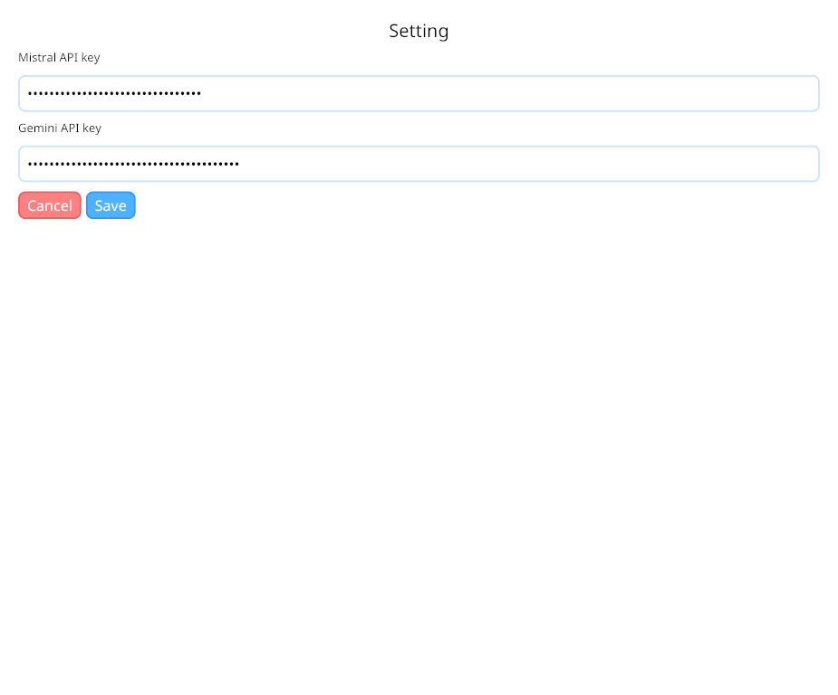

# Chatboto

This is a simple desktop app built with [Iced](https://iced.rs) that allows you to chat with AI:
 - **Mistral**
 - **Gemini**

## Screenshots


---



## Installation

1. Clone this repository:
```bash
git clone https://github.com/j03-dev/chatboto.git
cd chatboto
```

2. Build the application:
```bash
cargo build --release
```

## Configuration

Chatboto requires API keys for the AI models it uses. Create a `.env` file in the root directory with the following contents:

```env
MISTRAL_API_KEY=your_mistral_api_key_here
GEMINI_API_KEY=your_gemini_api_key_here
```

You can obtain these API keys by:
- Mistral API key: Sign up at [mistral.ai](https://mistral.ai)
- Gemini API key: Get it from [Google AI Studio](https://aistudio.google.com)

The application will automatically load these environment variables at startup.

## Usage

Run the application:
```bash
cargo run --release
```

Use the settings button to switch between Mistral and Gemini models for your conversations.
